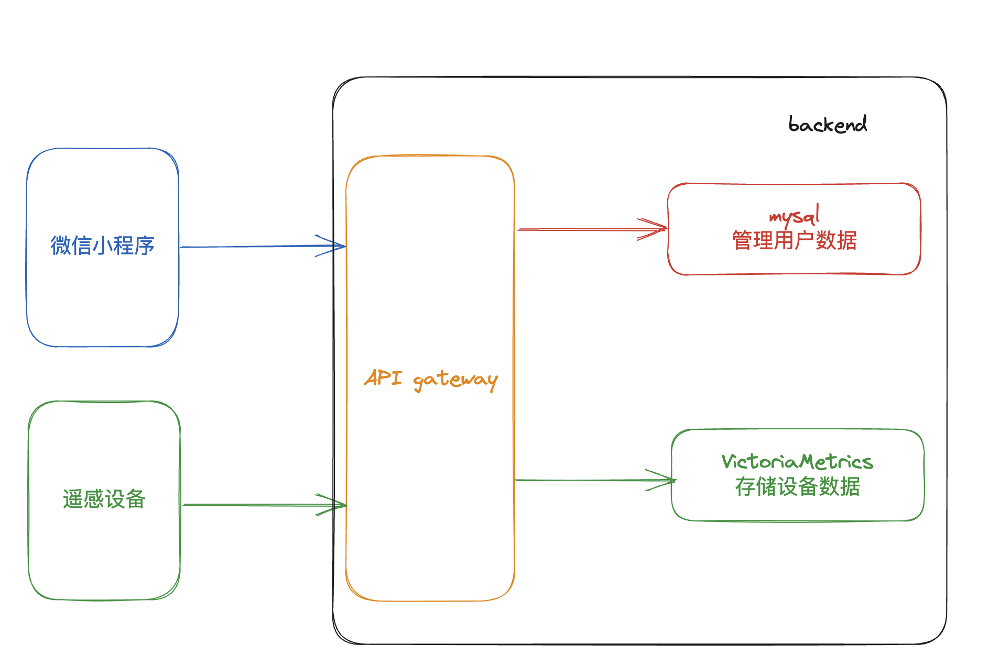

## Heartbeat Monitoring Project
Heartbeat Moniotring 简称 HM 由以下组件组成：
- User Device, 用户设备，基于雷达原理测量并收集用户心跳数据，发送心跳数据到云端。
- 微信小程序， 用户接入设备/服务UI，提供用户管理，设备管理，服务设置等相关功能。
- 后端服务，对外提供服务，提供用户管理，设备数据，增删改查功能。

> 以下主要描述微信小程序和后端服务的系统设计

## 微信小程序（前端）

### 功能
- 与User Device通信，初始化设备
- 用户管理，设备管理，相关服务UI

具体见： [前端设计](./front-end.md)

## 后端设计

